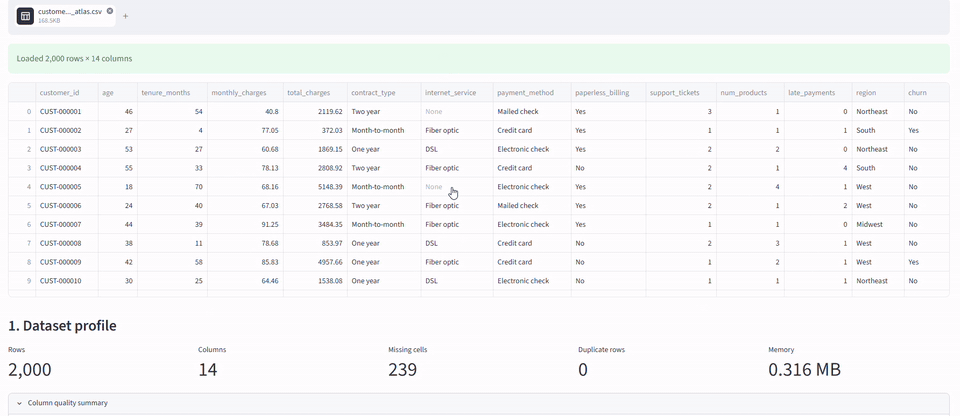

# 🧠 ML Atlas 2026

### An Interactive End-to-End Machine Learning Engineering Platform

[](https://www.python.org/)
[](https://ml-atlas-2026.streamlit.app/)
[](https://scikit-learn.org/)
[](https://fastapi.tiangolo.com/)
[](https://www.docker.com/)
[](https://github.com/features/actions)
[](#)
[](LICENSE)

> **Explore → Experiment → Benchmark → Optimize → Operationalize → Deploy**

**ML Atlas 2026** is an interactive machine-learning engineering platform that brings together ML concept exploration, real-dataset analysis, automated model benchmarking, model optimization, production-oriented diagnostics, and API-based inference in one project.

It demonstrates the progression from understanding machine-learning algorithms to building, evaluating, operationalizing, packaging, and releasing ML systems.

---

## 🚀 Live Application

### 👉 [Launch ML Atlas 2026](https://ml-atlas-2026.streamlit.app/)

Explore the application directly in your browser.

No local installation is required for the hosted Streamlit version.

---

## 🎯 Why ML Atlas 2026?

Many machine-learning portfolio projects demonstrate only one part of the lifecycle:

- a notebook,
- a single trained model,
- a visualization,
- or an isolated prediction API.

**ML Atlas 2026 takes a broader approach.**

The project connects:

```text
Machine Learning Fundamentals
            ↓
Interactive Algorithm Exploration
            ↓
Dataset Intelligence
            ↓
Automated Model Benchmarking
            ↓
Model Optimization & Explainability
            ↓
Production ML Diagnostics
            ↓
API & Container Packaging
            ↓
Automated Testing & Release
```

The result is a single environment for exploring both **machine-learning concepts and practical ML engineering workflows**.

---

# ✨ Core Capabilities

## 🧭 1. Machine Learning Taxonomy Explorer

Navigate a structured machine-learning landscape covering major learning paradigms and algorithm families.

The taxonomy includes areas such as:

- Supervised Learning
- Unsupervised Learning
- Semi-Supervised Learning
- Self-Supervised Learning
- Reinforcement Learning
- Deep Learning
- Transfer Learning
- Ensemble Learning
- Generative AI
- Probabilistic Graphical Models

Example algorithm families include:

### Regression

- Linear Regression
- Polynomial Regression
- Ridge Regression
- Lasso Regression

### Classification

- Logistic Regression
- Naive Bayes
- k-Nearest Neighbors
- Decision Trees
- Support Vector Machines

### Clustering

- K-Means
- DBSCAN
- Agglomerative Clustering
- Mean Shift

### Dimensionality Reduction

- PCA
- t-SNE
- UMAP
- SVD
- LDA

> The taxonomy intentionally extends beyond the algorithms currently implemented in the runnable playground.

---

## 🧪 2. Model Playground

Experiment with machine-learning algorithms through an interactive interface.

The playground helps demonstrate how different algorithms behave under different datasets, decision boundaries, and parameter configurations.

It provides a practical bridge between:

> understanding an algorithm conceptually

and

> observing its behavior experimentally.

---

## 📊 3. Dataset Lab

Upload a real dataset and move directly into an automated ML workflow.

### Supported formats

```text
CSV
XLSX
XLS
```

The Dataset Lab provides:

- Dataset inspection
- Dataset profiling
- Missing-value analysis
- Feature-type detection
- Target selection
- Identifier-like target protection
- Automatic task inference
- Train/test splitting
- Leakage-aware preprocessing
- Multi-model benchmarking
- Model comparison
- Best-model selection
- Performance visualization
- Prediction export

---

## 🎬 Product Demo

See ML Atlas 2026 in action — from interactive ML exploration and dataset benchmarking to model optimization and production ML workflows.

▶️ **[](docs/demo/ml-atlas-2026-demo.mp4)**

The demo covers:

- Machine Learning Taxonomy Explorer
- Model Playground
- Dataset Lab
- Automated model benchmarking
- Optimization Lab
- Production ML Lab
- Drift monitoring
- Model diagnostics
- Batch prediction

### 🚀 [Try the Live Application](https://ml-atlas-2026.streamlit.app/)

---

# 🤖 Automated Task Detection

ML Atlas can infer whether a selected target represents a:

```text
Classification Problem
```

or:

```text
Regression Problem
```

The inferred task determines which model families and evaluation metrics are used.

This reduces the manual configuration required to establish an initial machine-learning benchmark.

The application also includes safeguards against accidentally treating high-cardinality identifier fields as classification targets.

---

# 🏆 Model Benchmarking

ML Atlas can benchmark multiple algorithms against the same dataset and preprocessing strategy.

## Classification Models

Depending on the experiment configuration, models can include:

- Logistic Regression
- Support Vector Machine
- k-Nearest Neighbors
- Decision Tree
- Random Forest
- Extra Trees
- Gradient Boosting

### Classification Metrics

```text
Accuracy
Weighted Precision
Weighted Recall
Weighted F1 Score
ROC-AUC
```

---

## Regression Models

Regression benchmarking can include:

- Linear Regression
- Ridge Regression
- Lasso Regression
- Decision Tree Regressor
- Random Forest Regressor
- Extra Trees Regressor
- Gradient Boosting Regressor

### Regression Metrics

```text
MAE
RMSE
R²
```

Results are presented through an interactive **model leaderboard** so users can compare candidate algorithms instead of relying on a single manually selected estimator.

---

# 🔬 Optimization Lab

Model evaluation should not depend on a single train/test split.

The **Optimization Lab** extends the benchmarking workflow with more rigorous model evaluation and optimization techniques.

---

## 🔁 Cross-Validation

Run configurable K-fold cross-validation and inspect:

- Fold-level performance
- Mean validation performance
- Standard deviation
- Model stability

Example:

```text
Fold 1 → Accuracy
Fold 2 → Accuracy
Fold 3 → Accuracy
Fold 4 → Accuracy
Fold 5 → Accuracy

Mean Accuracy
Standard Deviation
```

For classification tasks, stratified cross-validation is used where appropriate.

---

## ⚙️ Hyperparameter Optimization

Selected models can be tuned using bounded hyperparameter search.

The optimization workflow:

1. Defines candidate hyperparameter configurations
2. Evaluates candidates using cross-validation
3. Compares validation performance
4. Identifies the strongest configuration
5. Refits the selected model

The search space is intentionally bounded to remain suitable for lightweight hosted compute such as Streamlit Community Cloud.

---

# 📈 Model Diagnostics

Depending on the ML task and model capabilities, ML Atlas provides additional diagnostics.

## Classification

- Confusion Matrix
- Classification report
- ROC analysis
- ROC-AUC
- Precision–Recall analysis
- Average Precision
- Decision-threshold analysis
- Precision/Recall/F1 trade-offs

## Regression

- Actual vs Predicted visualization
- Residual analysis
- Residual distribution
- MAE
- RMSE
- R²

These diagnostics provide substantially more information than a single headline metric.

---

# 🎯 Decision-Threshold Analysis

For compatible binary classifiers, ML Atlas evaluates different probability thresholds.

Instead of automatically assuming:

```text
Threshold = 0.50
```

the Optimization Lab can compare thresholds using objectives such as:

- Positive-class F1
- Recall
- Precision
- Accuracy

This demonstrates an important production ML concept:

> **Model selection and decision-threshold selection are different problems.**

The best threshold depends on the cost of false positives and false negatives in the actual use case.

---

# 🔎 Explainability

ML Atlas includes model-interpretation capabilities designed to help answer:

> **Which features are contributing most strongly to model behavior?**

Permutation-based feature importance evaluates how much held-out model performance changes when individual features are shuffled.

This provides a model-agnostic explainability technique that can operate across multiple estimator families.

The application exposes:

- Feature importance ranking
- Mean permutation importance
- Importance variability
- Visual importance comparison

---

# 📄 Experiment Reports

Optimization results can be exported into an experiment report containing information such as:

- Dataset
- Target
- Task
- Benchmark leaderboard
- Selected model
- Cross-validation summary
- Hyperparameter results
- Threshold analysis
- Explainability results

This makes experiments easier to document and review outside the application.

---

# 🏭 Production ML Lab

Phase 4 extends ML Atlas beyond model development into lightweight production-oriented ML workflows.

The **Production ML Lab** includes:

- Experiment tracking
- Lightweight model registry
- Schema validation
- Data drift monitoring
- Calibration analysis
- Fairness diagnostics
- Learning curves
- Batch prediction
- Model-card generation

---

# 🧾 Experiment Tracking

Capture information about ML experiments, including:

- Experiment ID
- Dataset
- Target
- Task
- Model
- Metrics
- Parameters
- Notes
- Timestamp

Conceptually:

```text
Dataset
   ↓
Experiment
   ↓
Metrics
   ↓
Model Candidate
```

Experiment history can also be exported for further analysis.

---

# 🗃️ Lightweight Model Registry

Successful experiments can be promoted into a lightweight model registry.

Supported conceptual stages include:

```text
Candidate
    ↓
Staging
    ↓
Champion
    ↓
Archived
```

The registry tracks information such as:

- Model version
- Model name
- Experiment ID
- Registry stage
- Registration timestamp
- Notes

> The Streamlit implementation intentionally uses lightweight session-scoped state. It is not presented as a replacement for durable systems such as MLflow Model Registry or managed cloud model registries.

---

# 📉 Data Drift Monitoring

Model behavior can degrade when production data diverges from the data used during training.

ML Atlas includes lightweight distribution-shift analysis using **Population Stability Index (PSI)**.

Conceptually:

```text
Training Dataset
        ↓
Reference Distribution

Current Dataset
        ↓
Current Distribution

Reference vs Current
        ↓
Population Stability Index
        ↓
Potential Distribution Shift
```

The application categorizes feature behavior into states such as:

```text
Stable
Moderate Shift
Significant Shift
```

PSI is used as a monitoring indicator rather than proof of model-performance degradation or causality.

---

# 🧬 Schema Monitoring

Before scoring a new dataset, ML Atlas can compare its schema with the reference feature set.

Checks can identify:

- Missing columns
- New columns
- Data-type changes
- Compatible columns

This helps identify incompatible input data before inference.

---

# ⚖️ Fairness Diagnostics

For suitable binary classification experiments, ML Atlas can expose group-level diagnostics across a user-selected field.

Metrics can include:

- Accuracy
- Positive-class Precision
- Positive-class Recall
- Positive-class F1
- Positive prediction rate
- Recall gaps between groups
- Prediction-rate gaps between groups

These diagnostics are intended for experimentation and educational analysis.

They should **not** be treated as a complete fairness, compliance, or model-risk framework.

Real-world high-impact ML systems require domain-specific fairness definitions, governance processes, legal review, data-quality validation, and continuous monitoring.

---

# 🎯 Calibration

For compatible probabilistic classifiers, calibration analysis evaluates whether predicted probabilities correspond to observed outcomes.

A well-calibrated model predicting:

```text
P(positive) = 0.80
```

should ideally observe approximately an 80% positive rate across sufficiently large groups of similar predictions.

ML Atlas includes:

- Calibration curves
- Brier score

Calibration becomes especially important when downstream decisions depend on probability estimates rather than only class labels.

---

# 📚 Learning Curves

Learning curves show how model performance changes as the amount of training data increases.

They can help identify patterns associated with:

- Underfitting
- Overfitting
- Insufficient training data
- High variance
- Diminishing returns from additional samples

ML Atlas compares training and validation performance across different training-set sizes.

---

# 🔮 Batch Prediction

The Production ML workflow supports batch-oriented inference using compatible unseen datasets.

Conceptually:

```text
New Dataset
     ↓
Schema-Compatible Features
     ↓
Saved Preprocessing Pipeline
     ↓
Trained Model
     ↓
Predictions
     ↓
CSV Export
```

Probability columns are also included when the underlying classifier supports `predict_proba()`.

This demonstrates the transition from model experimentation to repeatable inference.

---

# 📋 Model Cards

ML Atlas can generate downloadable model-card documentation containing:

- Model name
- Dataset
- Task
- Target
- Experiment ID
- Evaluation metrics
- Intended use
- Known limitations
- Notes

Model cards provide a lightweight documentation layer around model artifacts and experiments.

---

# 🌐 FastAPI Inference Service

Phase 5 packages model inference behind a **FastAPI** service.

The API includes:

```text
GET  /health
GET  /model-info
POST /predict
```

This separates model serving from the interactive Streamlit interface.

Conceptually:

```text
Client
   │
   ▼
FastAPI
   │
   ▼
Model Service
   │
   ▼
Preprocessing Pipeline
   │
   ▼
Trained Model
   │
   ▼
Prediction
```

---

## API Health Check

```http
GET /health
```

Returns service status and model-loading information.

---

## Model Information

```http
GET /model-info
```

Returns metadata about the currently loaded model artifact.

---

## Prediction Endpoint

```http
POST /predict
```

Example request:

```json
{
  "records": [
    {
      "sepal length (cm)": 5.1,
      "sepal width (cm)": 3.5,
      "petal length (cm)": 1.4,
      "petal width (cm)": 0.2
    }
  ]
}
```

The response contains predictions and, when supported, class probabilities.

---

# 🐳 Docker Support

ML Atlas includes containerization support for reproducible execution.

## Build the image

```bash
docker build -t ml-atlas-2026 .
```

## Run the Streamlit container

```bash
docker run --rm -p 8501:8501 ml-atlas-2026
```

---

## Docker Compose

The repository also contains Docker Compose configuration for running both the UI and inference API.

```bash
docker compose up --build
```

Services:

```text
Streamlit UI → http://localhost:8501
FastAPI      → http://localhost:8000
Swagger UI   → http://localhost:8000/docs
```

Stop the stack with:

```bash
docker compose down
```

---

# 🧪 Automated Testing

The repository includes automated tests covering the core ML Atlas functionality.

Run locally:

```bash
pytest -q
```

For detailed output:

```bash
pytest -v
```

The test suite covers areas such as:

- Taxonomy utilities
- Task detection
- Data preprocessing
- Model benchmarking
- Classification workflows
- Regression workflows
- Cross-validation
- Hyperparameter tuning
- Threshold analysis
- Explainability
- Drift utilities
- Experiment tracking
- Model registry behavior
- Fairness diagnostics
- Calibration
- Batch prediction
- Model-card generation
- FastAPI endpoints

---

# 🔄 Continuous Integration

GitHub Actions automatically validates repository changes.

The CI pipeline performs operations such as:

```text
Checkout Repository
        ↓
Set Up Python
        ↓
Install Dependencies
        ↓
Train Deterministic Demo Model
        ↓
Run Automated Tests
        ↓
Verify Application Imports
```

This helps prevent regressions from being merged unnoticed.

---

# 📦 Release Automation

ML Atlas includes a GitHub Actions release workflow triggered by version tags.

Current stable release:

```text
v1.0.0
```

The release-oriented repository includes:

- CHANGELOG
- Release checklist
- CI workflow
- Release workflow
- Deployment documentation
- Security documentation
- Architecture documentation

---

# 🏗️ System Architecture

```text
                         ┌─────────────────────────┐
                         │      ML Atlas 2026      │
                         └────────────┬────────────┘
                                      │
              ┌───────────────────────┼────────────────────────┐
              │                       │                        │
              ▼                       ▼                        ▼
      Taxonomy Explorer         Model Playground          Dataset Lab
                                                               │
                                                               ▼
                                                       Dataset Profiling
                                                               │
                                                               ▼
                                                         Task Detection
                                                               │
                                                               ▼
                                                         Preprocessing
                                                               │
                                                               ▼
                                                      Model Benchmarking
                                                               │
                                                               ▼
                                                       Model Leaderboard
                                                               │
                                                               ▼
                                                       Optimization Lab
                                                               │
                                          ┌────────────────────┼────────────────────┐
                                          │                    │                    │
                                          ▼                    ▼                    ▼
                                  Cross-Validation          Tuning          Explainability
                                          │                    │                    │
                                          └────────────────────┼────────────────────┘
                                                               │
                                                               ▼
                                                      Production ML Lab
                                                               │
                          ┌────────────────┬────────────────────┼───────────────────┐
                          │                │                    │                   │
                          ▼                ▼                    ▼                   ▼
                    Experiments         Registry             Drift             Diagnostics
                          │                │                    │                   │
                          └────────────────┴────────────────────┼───────────────────┘
                                                               │
                                                               ▼
                                                          Model Pipeline
                                                               │
                                                 ┌─────────────┴─────────────┐
                                                 │                           │
                                                 ▼                           ▼
                                         Batch Prediction              FastAPI Service
                                                                             │
                                                                             ▼
                                                                           Docker
                                                                             │
                                                                             ▼
                                                                    Deployment / Release
```

---

# 🗺️ Five-Phase Development Roadmap

ML Atlas 2026 was developed incrementally across five phases.

| Phase | Focus | Major Capabilities |
|---|---|---|
| **Phase 1** | ML Exploration | Taxonomy Explorer, Model Playground, Algorithm Recommender |
| **Phase 2** | Dataset Intelligence | Dataset Lab, profiling, task detection, preprocessing, benchmarking |
| **Phase 3** | Optimization | Cross-validation, tuning, diagnostics, threshold analysis, explainability |
| **Phase 4** | Production ML | Experiment tracking, registry, drift analysis, calibration, fairness diagnostics, learning curves, batch prediction |
| **Phase 5** | Packaging & Release | FastAPI, Docker, CI/CD, release automation, architecture, deployment and security documentation |

### Roadmap Status

```text
Phase 1  ████████████████████  100%
Phase 2  ████████████████████  100%
Phase 3  ████████████████████  100%
Phase 4  ████████████████████  100%
Phase 5  ████████████████████  100%
```

### ✅ v1.0.0 Roadmap Complete

---

# 🧰 Technology Stack

| Layer | Technology |
|---|---|
| Language | Python |
| Interactive UI | Streamlit |
| Machine Learning | scikit-learn |
| Data Processing | pandas / NumPy |
| Visualization | Plotly / Matplotlib / Streamlit |
| API | FastAPI |
| API Server | Uvicorn |
| Testing | pytest |
| Containerization | Docker |
| Local Orchestration | Docker Compose |
| CI/CD | GitHub Actions |
| Source Control | Git / GitHub |
| Deployment | Streamlit Community Cloud |

---

# 📁 Repository Structure

```text
ml-atlas-2026/
│
├── app.py
├── README.md
├── CHANGELOG.md
├── LICENSE
├── requirements.txt
├── Dockerfile
├── docker-compose.yml
├── Makefile
│
├── ml_atlas/
│   ├── __init__.py
│   ├── registry.py
│   ├── recommender.py
│   ├── playground.py
│   ├── automl.py
│   ├── data_lab.py
│   ├── profiling.py
│   ├── phase3.py
│   └── phase4.py
│
├── api/
│   ├── __init__.py
│   ├── main.py
│   └── model_service.py
│
├── scripts/
│   └── train_demo_model.py
│
├── tests/
│   ├── test_phase3.py
│   ├── test_phase4.py
│   ├── test_api.py
│   └── ...
│
├── docs/
│   ├── ARCHITECTURE.md
│   ├── DEPLOYMENT.md
│   ├── SECURITY.md
│   ├── RELEASE_CHECKLIST.md
│   ├── PHASE3.md
│   ├── PHASE4.md
│   └── PHASE5.md
│
├── .github/
│   └── workflows/
│       ├── ci.yml
│       └── release.yml
│
└── .streamlit/
    └── config.toml
```

---

# 💻 Local Installation

## 1. Clone the repository

```bash
git clone https://github.com/BaharathBathula/ml-atlas-2026.git
cd ml-atlas-2026
```

---

## 2. Create a virtual environment

### Windows

```bash
python -m venv .venv
.venv\Scripts\activate
```

### macOS / Linux

```bash
python3 -m venv .venv
source .venv/bin/activate
```

---

## 3. Install dependencies

```bash
pip install --upgrade pip
pip install -r requirements.txt
```

---

## 4. Start ML Atlas

```bash
streamlit run app.py
```

Streamlit will display the local application address in the terminal.

---

# 🌐 Run the FastAPI Service

First generate the deterministic demonstration model:

```bash
python scripts/train_demo_model.py
```

Then start the API:

```bash
uvicorn api.main:app --host 0.0.0.0 --port 8000
```

Open the interactive Swagger documentation:

```text
http://localhost:8000/docs
```

---

# 🧪 Run Tests

```bash
pytest -q
```

For detailed output:

```bash
pytest -v
```

---

# 🚀 Try the Live Demo

The easiest way to explore ML Atlas is through the hosted Streamlit application:

## 🧠 [Open ML Atlas 2026](https://ml-atlas-2026.streamlit.app/)

Recommended workflow:

1. Open **Taxonomy Explorer** to navigate ML concepts.
2. Use **Model Playground** for interactive experiments.
3. Open **Dataset Lab** and upload a CSV or Excel dataset.
4. Select the target and run model benchmarking.
5. Open **Optimization Lab** to evaluate and optimize the selected models.
6. Open **Production ML Lab** to explore experiment tracking, drift, calibration, fairness, learning curves, and batch inference.

---

# 🛡️ Security & Production Scope

ML Atlas 2026 is an **educational, engineering, and portfolio project**.

The project demonstrates production-oriented ML concepts, but it should **not** be interpreted as a fully hardened enterprise ML platform.

A real production deployment would require additional controls such as:

- Authentication
- Authorization / RBAC
- Secrets management
- Persistent experiment storage
- Durable model registry
- Database-backed metadata
- API rate limiting
- Centralized observability
- Audit logging
- Infrastructure monitoring
- Dependency scanning
- Container scanning
- Model approval workflows
- Data governance
- Privacy controls
- Domain-specific validation
- Disaster recovery
- High availability

Additional security consideration:

> Python pickle model artifacts should never be loaded from untrusted sources.

These boundaries are intentional and documented rather than hidden.

---

# 🎓 What This Project Demonstrates

ML Atlas 2026 demonstrates practical experience across several layers of modern machine-learning engineering.

## Machine Learning

- Classification
- Regression
- Model selection
- Model evaluation
- Cross-validation
- Hyperparameter tuning
- Threshold analysis
- Calibration

## Data Science

- Dataset profiling
- Feature handling
- Missing-value treatment
- Data preprocessing
- Distribution analysis
- Model diagnostics

## ML Engineering

- Reusable pipelines
- Automated model benchmarking
- Batch inference
- Experiment tracking concepts
- Model registry concepts
- Drift detection
- Explainability
- Model documentation

## Software Engineering

- Modular Python architecture
- Automated testing
- API design
- Containerization
- CI/CD
- Versioned releases
- Technical documentation

## MLOps Concepts

- Experiment lifecycle
- Model registration
- Data drift monitoring
- Schema monitoring
- Production diagnostics
- Deployment packaging
- Release automation

---

# 🔭 Potential Future Extensions

The **v1.0.0 roadmap is complete**.

Potential future extensions include:

- MLflow integration
- Optuna-based optimization
- SHAP explainability
- XGBoost
- LightGBM
- CatBoost
- Time-series workflows
- Expanded unsupervised workflows
- Persistent experiment database
- Durable production model registry
- Authentication and RBAC
- REST API authentication
- Kubernetes deployment
- Cloud infrastructure templates
- Prometheus metrics
- Grafana dashboards
- Advanced drift monitoring
- Model-performance monitoring
- LLM / Generative AI experimentation

These are **potential future extensions**, not capabilities claimed by the current v1.0.0 release.

---

# 📜 License

This project is released under the **MIT License**.

See [`LICENSE`](LICENSE) for details.

---

# 👤 Author

## Baharath Bathula

**ML / AI Engineering • Data Engineering • AI Systems**

Built as a hands-on exploration of the modern machine-learning lifecycle — from algorithms and datasets to optimization, production diagnostics, APIs, containers, CI/CD, and automated releases.

---

# ⭐ Support the Project

If **ML Atlas 2026** is useful for learning, experimentation, or ML engineering reference, consider giving the repository a ⭐.

### 🚀 [Try ML Atlas 2026 Live](https://ml-atlas-2026.streamlit.app/)

---

<div align="center">

### ML Atlas 2026 · v1.0.0

**Explore · Experiment · Benchmark · Optimize · Operationalize · Deploy**

</div>
